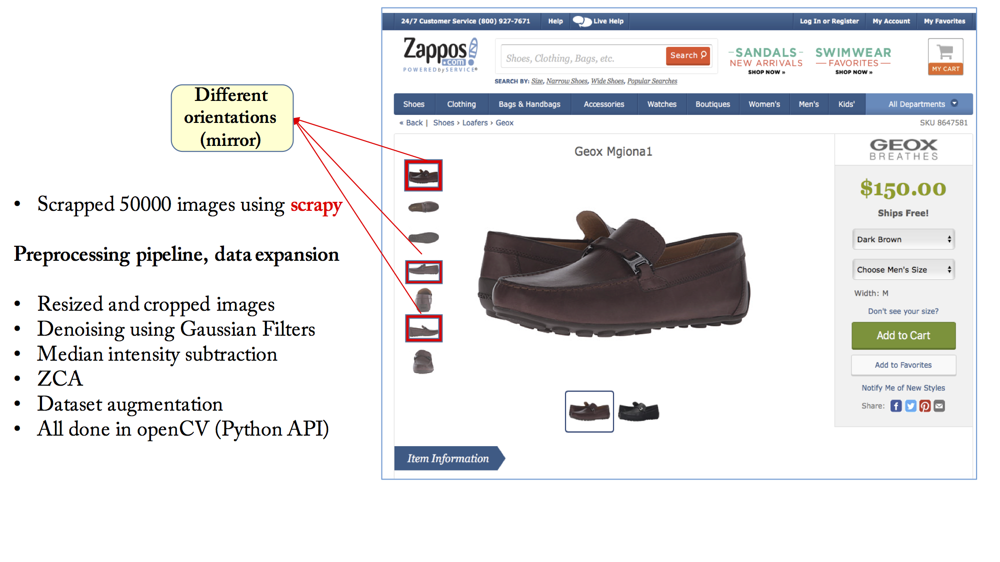
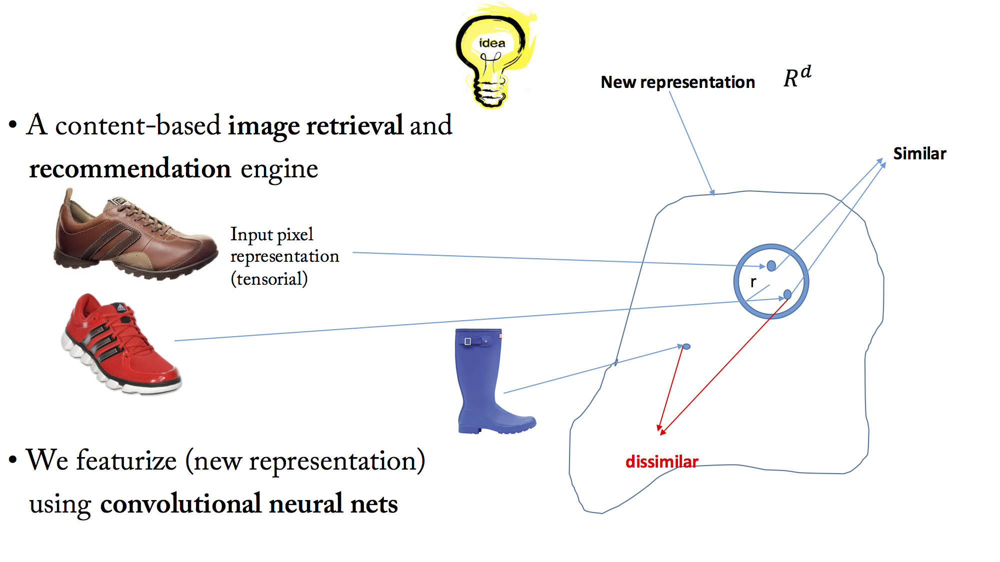
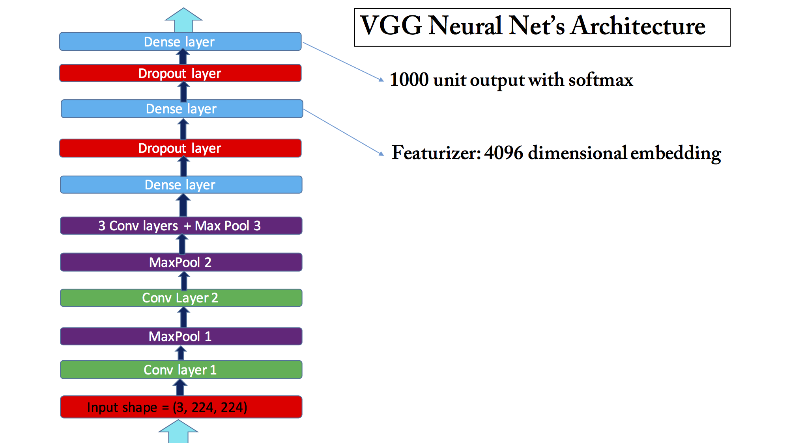
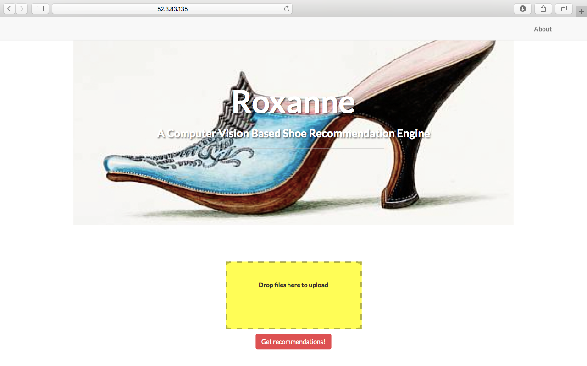

# DeepNeuralNet-Based-Shoe-Recommender

Roxanne is a web application which makes shoe recommendations from Zappos.com based on user's uploded shoe image using convolutional deep neural nets.

# Data Collection

Data was collected by scraping shoe images from *Zappos.com*. The style of content presentation on *Zappos.com* allowed for scraping shoe images in different style categories and different spatial orientations. The text indicating categories were displayed along the images. The background has already been removed from images. These facts about content presentation on *Zappos.com* simplified scraping and building a labeled dataset for further experimentation.
Scraping was done using python library Scrapy. It allows for a systematic access to elements on a web page page through *xpath language*.

# Preprocessing

The preprocessing pipeline consisted of the following stages. First input images were resized. The scrapped image were 1920 pixels wide and 1440 pixels high. Using *openCV* Python API, images were resized to 256 pixels while keeping the original aspect ratio intact.
At next stage, images were cropped down to squares of dimension 224 pixels. This was necessary since the input layer of the convolutional neural net (CNN) used in the modeling accepts a 4-dimensional tensor, a collection of (3, 224, 224) dimensional input image tensors stacked on top of each other, where 3 is the number of channels in the image.

One preprocessing step which improved model performance by a few percent was to filter out noise in the images using a Gaussian filter blur. The filter takes two input parameters, the variances of the gaussian kernel along the two dimensions of the input image. Experimentation showed a filter of size (3, 3) performed best.

Another useful manipulation of the images was to subtract the mean (or median) of the pixel values so that the overall mean intensity of every images is set to zero.

Soon it became clear that the color channel had to be handled separately.

As usual dataset expansion is always useful. In our case it made sense to flip the images around the middle vertically (i.e., it would give another *meaningful* image) but conveniently the mirrored view was already on the website so it only needed to be scrapped

`Future work on preprocessing:`
It was found experimentally that background objects in the input image degrades the quality of recommendations. This is to be expected of course. The next step would be to incorporate the `background removal` stage into the pipeline.

# Modeling

Roxanne is an image similarity engine. The idea behind an engine like this is to find a new representation of the input *raster* image (pixels data represented as a tensor), in which similar images are close and any two dissimilar images are separated at least by a pre-set margin given a definition of a distance (we used cosine similarity)

There also exists a different way of thinking about an image similarity engine which is supervised in nature. I also experimented with that design. Refer to `Siamese Architecture` section.

As first step VGG convolutional neural net was used to featurize the images. This `feature` vector is the new good representation of the input image. I picked the output of a 4096 dimensional deeper dense layer. VGG was trained on about 1.2 million images belonging to 1000 different classes. VGG's training set included shoe images which made the net a good candidate as featurizer. Here is the architecture of the net:

At code level, architecture of the VGG convolutional net was recreated in `lasagne`, the python library for `deep learning`. The weights and biases in the CNN are loaded from the pickled pre-trained model.

# Interesting observations about the dataset

It soon became apparent that the quality of recommendations degrades significantly when the dominant characteristic of the input image is its color (say an all-orange shoe input image). In such cases, spatial features like shape were mostly overshadowed and ignored in generating recommendations.

To address this situation, one needs to convert the *RGB* images into *grayscale* and then featurize. And only then incorporate color information into the pipeline separately. This would be in the form of extending the feature vector to include a color histogram. openCV provides a high level API for computing color histograms. Influence of the color channel is controlled by assigning a weight to the color portion of the feature vector. Taking the weight as an input from the user is the feature that is being added at the moment.

# Design

Images were featurized using VGG CNN as a batch job. It proved helpful to write a Theano function which took the input image and the dense layer (featurizer) as input and returned the 4096 dimensional feature vector. This speeds up the featurization process since you compile only once and call the compiled Theano function many times.

The backend storage is MongoDB. The features are clustered into a 100 different clusters using MiniBatchKmeans. The centroids associated to each cluster along with a list of images belonging to the corresponding cluster are stored in a Mongo collection.

 The 4096 dimensional feature vectors are sparse (up to 50% of the elements are zero). A sparse representation of each vector is stored in a collection (simple hashing). At start up, Flask app uploads the centroids into memory. The uploaded image is featurized and its cosine similarity is computed against the centroids. The cluster corresponding the most similar centroid is picked and the cosine similarity is further computed with all images within that cluster and then sorted.

 This design speeds up making recommendations. and also only a fraction of features is loaded into memory at start up.

## Scalable design using Apache Spark and S3

When the number of images in the data base increases, reading in the collection into the memory is not possible. An alternative design, currently being implemented, is to write the image features into a S3 bucket. At start up, the features are loaded up from S3 into an RDD. When an image is uploaded through the front-end, cosine-similarities between the input and the cluster centroids (and inside the most similar cluster) are calculated as a MapReduce job on the Spark cluster.
This would be the data flowchart

# How the app looks like

There is a drag and drop zone on front-end. User can simply drag and drop an image (acceptable extensions are jpg, gif and png). Wait for the progress bar to get completely filled and a check-mark to appear on the thumbnail. Pressing "Get recommendations!" will generate top-5 recommendations based on spatial characteristics of the input

## Disclaimer

Presence of background objects in the image degrades the quality of recommendations. Similarly, if color is the dominant visual element, recommendations might feel confused. See above (interesting observations about the dataset).
